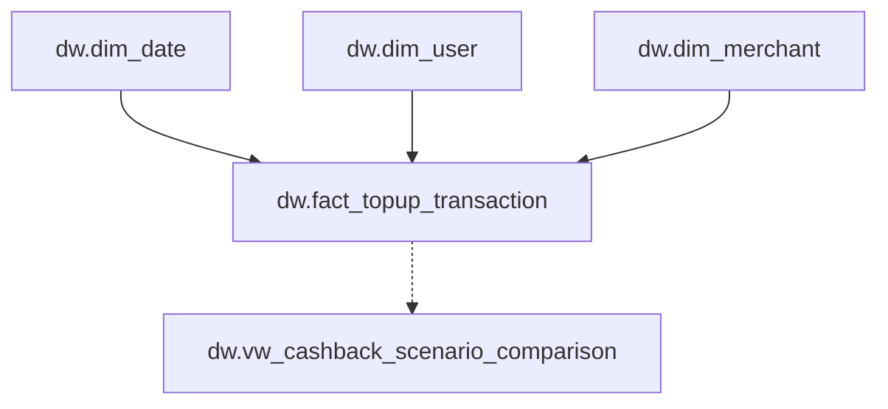

# MoMo Mobile Topup Performance & Cashback Strategy Analysis

[View the live Dashboard](https://app.powerbi.com/view?r=eyJrIjoiZmViZTA5YmEtZDI4OC00ZjNlLWIwNzEtN2RmZDBjOWUyNjkyIiwidCI6IjM3MGZiM2I4LTMzMDYtNDg5MC05MDYzLWNjMDhiZTc4ODI1NyIsImMiOjEwfQ%3D%3D) 

An end-to-end analytics project built with **SQL Server** and **Power BI** to evaluate Mobile Topup performance, identify growth drivers across time, merchants, and customer segments, and assess the financial sustainability of a proposed cashback strategy.

> **Core decision:** Growth should be scaled only when incremental contribution offsets the additional cashback cost.

---

## Table of Contents

- [Business Context](#-business-context)
- [Business Objectives](#-business-objectives)
- [Business Requirements](#-business-requirements)
- [Data Scope](#-data-scope)
- [Analytical Approach](#-analytical-approach)
- [Data Processing with SQL](#-data-processing-with-sql)
- [Data Model](#-data-model)
- [Core KPI Definitions](#-core-kpi-definitions)
- [Descriptive Analysis](#-descriptive-analysis)
- [Power BI Report](#-power-bi-report)
- [Diagnostic Insights](#-diagnostic-insights)
- [Recommendations](#-recommendations)
- [Cashback Experiment Framework](#-cashback-experiment-framework)
- [Repository Structure](#-repository-structure)
- [Limitations](#-limitations)
- [Author](#-author)

---

## 🧭 Business Context

MoMo's Mobile Topup service enables users to recharge their own mobile balance or purchase mobile cards for others. The service is strategically important because of its broad reach, recurring transaction potential, and contribution to MoMo's ecosystem revenue.

The Vietnamese e-wallet market is highly competitive, with providers using aggressive cashback programmes to attract and retain users. MoMo is therefore considering increasing cashback rates across telecommunications merchants.

Before implementing this strategy, the business needs to understand:

- The current performance of the Mobile Topup service.
- The main drivers of GMV, commission revenue, and user activity.
- The differences in scale and monetisation across merchants.
- The acquisition, value, and transaction behaviour of customer segments.
- Whether incremental GMV can offset the additional cashback cost.

This project uses historical transaction data from **January to December 2020**, customer demographic information, and merchant commission rates.

---

## 🎯 Business Objectives

### 🔭 Overall objective

Develop an end-to-end analytical solution using SQL Server and Power BI that monitors Mobile Topup performance, identifies key growth drivers, and evaluates the financial sustainability of MoMo's proposed cashback strategy.

### ✅ Specific objectives

1. Measure monthly performance through transaction, customer, and financial metrics.
2. Identify the main drivers behind changes in GMV and commission revenue.
3. Understand customer demographics and transaction behaviour, especially differences between new and current users.
4. Evaluate merchant-level scale, monetisation, and contribution.
5. Quantify the financial impact of proposed cashback rates.
6. Estimate the GMV growth required to preserve current contribution.
7. Provide actionable recommendations for Marketing, Product, Partnership, and Finance teams.

---

## 📋 Business Requirements

The analytical solution must allow stakeholders to:

- Monitor orders, active users, GMV, gross revenue, contribution, AOV, ARPU, and purchase frequency.
- Analyse performance by month and telecommunications merchant.
- Compare self-use transactions with purchases made for other users.
- Track new-user acquisition and changes in the new-user rate.
- Compare merchant GMV share, revenue share, commission rate, and contribution.
- Analyse customer value by age group, gender, location, and lifecycle segment.
- Simulate different GMV uplift assumptions under the proposed cashback rates.
- Calculate merchant-level and portfolio-level break-even thresholds.
- Identify offers with financially impossible break-even conditions.
- Translate analytical results into clear decision guidance.

---

## 🗂️ Data Scope

| Data domain | Main fields | Analytical purpose |
|---|---|---|
| Transactions | Transaction date, value, user, merchant, purchase type | Orders, GMV, AOV, trends, and purchase behaviour |
| Customers | User ID, age, gender, location, customer status | Acquisition, demographics, and customer value |
| Merchants | Merchant name and commission rate | Revenue, contribution, and merchant economics |
| Date | Calendar date, month, and reporting attributes | Time intelligence and monthly comparison |
| Scenario inputs | Current cashback, proposed cashback, assumed GMV lift | Financial simulation and break-even analysis |

---

## 🔎 Analytical Approach

1. **Data profiling** — Reviewed source structure, data types, missing values, and business rules.
2. **Data preparation** — Standardised dates, merchant names, customer attributes, and transaction values in SQL Server.
3. **Business logic** — Created reusable calculations for GMV, commission revenue, cashback cost, and contribution.
4. **Data modelling** — Built a reporting model using date, customer, and merchant dimensions.
5. **DAX development** — Created governed measures for KPIs, time comparison, segmentation, and scenario analysis.
6. **Validation** — Reconciled portfolio, monthly, and merchant-level totals.
7. **Business interpretation** — Converted descriptive results into actions for Product, Marketing, Partnership, and Finance teams.

---

## 🧹 Data Processing with SQL

SQL Server was used to build a three-layer data pipeline before loading the analytical model into Power BI:


| Layer | Schema | Responsibility |
|---|---|---|
| Raw | `raw` | Preserve source data in its original structure for traceability |
| Staging | `stg` | Clean, standardise, validate, deduplicate, and derive reusable fields |
| Data Warehouse | `dw` | Store dimensional tables and the transaction fact used by Power BI |

This design separates ingestion, transformation, and reporting logic. Raw data remains unchanged, cleaning rules are auditable in staging, and Power BI connects only to governed warehouse objects.

### Creating the three SQL schemas

```sql
-- 1. Create the project database
CREATE DATABASE DB_MoMo_Topup;
GO

USE DB_MoMo_Topup;
GO

-- 2. Create the three data-layer schemas
CREATE SCHEMA raw;
GO

CREATE SCHEMA stg;
GO

CREATE SCHEMA dw;
GO
```

### Layer 1 — Raw data

The raw layer receives the source datasets without applying business transformations. Its purpose is to preserve the original values and provide a reproducible starting point for the pipeline.

Example raw tables:

- `raw.data_transaction`
- `raw.data_user_info`
- `raw.data_commission`

Rules applied to this layer:

- Keep original column names and source values.
- Do not overwrite incorrect or inconsistent records.
- Add load metadata where available, such as `source_file_name` and `loaded_at`.
- Restrict Power BI from reading raw tables directly.

### Layer 2 — Staging and data cleaning

The staging layer converts raw source values into clean and consistent business fields. Data-quality flags are retained so invalid records can be reviewed instead of silently removed.

#### Data-quality assessment

| Table | Column | Data problem | Preprocessing solution | Standardised output |
|---|---|---|---|---|
| `data_transaction` | `Date` | Mixed formats such as `YYYY-MM-DD` and `DD-MM-YYYY` | Parse both recognised formats with `TRY_CONVERT` | SQL `DATE` in `YYYY-MM-DD` format |
| `Data User_Info` | `First_tran_date` | Invalid values such as `9920-12-12` | Convert valid dates and flag impossible years for review | Clean date or data-quality flag |
| `Data User_Info` | `Location` | Multiple labels for the same location | Standardise equivalent values with `CASE` | `Ho Chi Minh City`, `Ha Noi`, `Other Cities` |
| `Data User_Info` | `Gender` | Inconsistent spelling and language, such as `Femal`, `FEMALE`, `F`, and `Nữ` | Normalise text, then map equivalent values | `Female`, `Male`, or `Unknown` |

#### Derived fields created in staging

| Derived field | Purpose |
|---|---|
| `transaction_date` | Consistent transaction-level date analysis |
| `month_start_date` | Monthly aggregation and Power BI date relationships |
| `month_year` | User-friendly reporting label |
| `standardised_location` | Consistent geographic grouping |
| `standardised_gender` | Consistent demographic analysis |
| `user_type` | Separation of new and current users |
| `purchase_type` | Separation of self-use and purchase-for-others transactions |
| `age_group` | Demographic comparison by age band |
| `gross_revenue` | Transaction value multiplied by merchant commission rate |
| `current_contribution` | Gross revenue after current cashback cost |

#### Staging output

The staging layer produces clean, reusable datasets such as:

- `stg.topup_transaction`
- `stg.user_info`
- `stg.merchant`

These objects become the controlled source for the Data Warehouse layer.

### Layer 3 — Data Warehouse

The Data Warehouse applies a star schema optimised for analysis. Dimensions provide descriptive attributes, while the fact table stores transaction-level measures and foreign keys.

| Warehouse object | Grain | Main purpose |
|---|---|---|
| `dw.dim_date` | One row per calendar date | Time intelligence and consistent date filtering |
| `dw.dim_user` | One row per user | Demographics, location, acquisition, and customer status |
| `dw.dim_merchant` | One row per merchant | Merchant name, commission rate, and commercial attributes |
| `dw.fact_topup_transaction` | One row per completed transaction | Orders, GMV, revenue, cashback cost, and contribution |

#### Creating `dw.dim_date`

The date dimension covers the complete analysis period and provides attributes required for Power BI time intelligence.

```sql
--- Create dim_date
CREATE TABLE dw.dim_date
(
    full_date          DATE          NOT NULL,
    day_number         TINYINT       NOT NULL,
    weekday_number     TINYINT       NOT NULL,
    weekday_name       NVARCHAR(10)  NOT NULL,
    month_number       TINYINT       NOT NULL,
    month_name         NVARCHAR(10)  NOT NULL,
    quarter_number     TINYINT       NOT NULL,
    quarter_name       CHAR(2)       NOT NULL,
    year_number        SMALLINT      NOT NULL,
    year_month         CHAR(7)       NOT NULL,
    year_month_sort    INT           NOT NULL,
    is_weekend         BIT           NOT NULL,
    CONSTRAINT PK_dw_dim_date
        PRIMARY KEY (full_date)
);

DECLARE @start_date DATE;
DECLARE @end_date DATE;
SELECT
    @start_date = MIN(transaction_date),
    @end_date   = MAX(transaction_date)
FROM stg.topup_transaction;
;WITH date_series AS
(
    SELECT @start_date AS full_date
    UNION ALL
    SELECT DATEADD(DAY, 1, full_date)
    FROM date_series
    WHERE full_date < @end_date
),
date_calculation AS
(
    SELECT
        full_date,
        CAST(DATEDIFF(DAY, '19000101', full_date) % 7 + 1 AS TINYINT) AS weekday_number
    FROM date_series
)
INSERT INTO dw.dim_date
(
    full_date,
    day_number,
    weekday_number,
    weekday_name,
    month_number,
    month_name,
    quarter_number,
    quarter_name,
    year_number,
    year_month,
    year_month_sort,
    is_weekend
)
SELECT
    full_date,
    DAY(full_date),
    weekday_number,
    CHOOSE(
        weekday_number,
        N'Monday',
        N'Tuesday',
        N'Wednesday',
        N'Thursday',
        N'Friday',
        N'Saturday',
        N'Sunday'
    ),
    MONTH(full_date),
    CHOOSE(
        MONTH(full_date),
        N'January',
        N'February',
        N'March',
        N'April',
        N'May',
        N'June',
        N'July',
        N'August',
        N'September',
        N'October',
        N'November',
        N'December'
    ),
    DATEPART(QUARTER, full_date),
    CONCAT('Q', DATEPART(QUARTER, full_date)),
    YEAR(full_date),
    CONVERT(CHAR(7), full_date, 126),
    YEAR(full_date) * 100 + MONTH(full_date),
    CASE
        WHEN weekday_number IN (6, 7) THEN 1
        ELSE 0
    END
FROM date_calculation
OPTION (MAXRECURSION 0)
```

`weekday_number` is calculated independently of the SQL Server `DATEFIRST` setting, with Monday represented by 1 and Sunday by 7.

Power BI connects to the `dw` schema rather than the raw or staging layers. This keeps report logic consistent and prevents data-cleaning rules from being duplicated in Power Query or DAX.

---

## 🧩 Data Model

The Power BI model follows a star-schema approach:



Key modelling principles:

- One-to-many relationships from `dw.dim_date`, `dw.dim_user`, and `dw.dim_merchant` to `dw.fact_topup_transaction`.
- `dw.dim_date[full_date]` filters transaction activity through `dw.fact_topup_transaction[transaction_date]`.
- Month, quarter, year, and weekday attributes come from the governed date dimension.
- Measures are used for rates and totals instead of directly aggregating raw rate columns.
- Disconnected parameter tables support scenario simulation and sensitivity analysis.
- `dw.vw_cashback_scenario_comparison` centralises current-versus-proposed cashback economics.
- Power BI imports only Data Warehouse objects; Raw and Staging remain outside the semantic model.

## 📐 Core KPI Definitions

| KPI | Definition |
|---|---|
| Total GMV | Total value of completed Mobile Topup transactions |
| Gross Revenue | Commission revenue earned from merchants before cashback cost |
| Current Cashback Cost | GMV multiplied by the current cashback rate |
| Current Contribution | Gross Revenue minus Current Cashback Cost |
| AOV | GMV divided by Total Orders |
| Gross ARPU | Gross Revenue divided by Active Users |
| Purchase Frequency | Total Orders divided by Active Users |
| New-user Rate | New Users divided by Total Active Users |
| Scenario Contribution | Proposed contribution adjusted by the selected assumed GMV lift |
| Contribution Gap | Scenario Contribution minus Current Contribution |
| Required GMV Lift | Current Contribution divided by Proposed Contribution, minus one |

> The **Required GMV Lift** is a mathematical break-even threshold, not a growth forecast. The **Assumed GMV Lift** is a scenario input, not an observed causal effect.

---

## 📊 Descriptive Analysis

SQL descriptive analysis was completed before dashboard development to answer the initial business requirements and establish validated benchmark figures.

### Overall performance

```sql
SELECT
    COUNT(DISTINCT order_id) AS total_orders,
    COUNT(DISTINCT user_id) AS active_users,
    SUM(amount) AS total_gmv,
    ROUND(
        SUM(amount) * 1.0 / NULLIF(COUNT(DISTINCT order_id), 0),
        2
    ) AS aov,
    SUM(revenue) AS gross_revenue
FROM dw.fact_topup_transaction;
```

| Total Orders | Active Users | Total GMV (VND) | AOV (VND) | Gross Revenue (VND) |
|---:|---:|---:|---:|---:|
| 13,496 | 13,391 | 696,604,234 | 51,615 | 18,752,727 |

### Requirement 1 — What was the gross revenue in January 2020?

```sql
SELECT
    SUM(revenue) AS january_gross_revenue
FROM dw.fact_topup_transaction
WHERE transaction_date >= '2020-01-01'
  AND transaction_date <  '2020-02-01';
```

**Answer:** January generated approximately **1,409,827 VND in gross revenue**.

### Requirement 2 — Which month generated the highest gross revenue?

```sql
SELECT TOP (1)
    d.year_month,
    SUM(f.amount) AS total_gmv,
    SUM(f.revenue) AS gross_revenue
FROM dw.fact_topup_transaction AS f
INNER JOIN dw.dim_date AS d
    ON f.transaction_date = d.full_date
GROUP BY
    d.year_month,
    d.year_month_sort
ORDER BY
    gross_revenue DESC;
```

**Answer:** **September 2020** recorded the highest gross revenue. It also generated **65.4M VND in GMV** and the highest monthly AOV of approximately **55K VND**.

### Requirement 3 — How did revenue vary by day of the week?

```sql
SELECT
    d.weekday_number,
    d.weekday_name,
    SUM(f.revenue) AS gross_revenue,
    COUNT(DISTINCT f.order_id) AS total_orders
FROM dw.fact_topup_transaction AS f
INNER JOIN dw.dim_date AS d
    ON f.transaction_date = d.full_date
GROUP BY
    d.weekday_number,
    d.weekday_name
ORDER BY
    d.weekday_number;
```

Because weekday attributes come from `dw.dim_date`, the result is consistently ordered from Monday to Sunday and does not depend on the SQL Server `DATEFIRST` setting.

### Requirement 4 — How many new users were acquired each month?

```sql
WITH monthly_user_acquisition AS
(
    SELECT
        d.year_month,
        d.year_month_sort,
        COUNT(DISTINCT f.user_id)
            AS total_transacting_users,
        COUNT(
            DISTINCT CASE
                WHEN f.user_type = N'New'
                THEN f.user_id
            END
        ) AS new_users,
        COUNT(
            DISTINCT CASE
                WHEN f.user_type = N'Current'
                THEN f.user_id
            END
        ) AS current_users,
        COUNT(
            DISTINCT CASE
                WHEN f.user_type = N'Unknown'
                THEN f.user_id
            END
        ) AS unknown_users
    FROM dw.fact_topup_transaction AS f
    INNER JOIN dw.dim_date AS d
        ON f.transaction_date = d.full_date
    GROUP BY
        d.year_month,
        d.year_month_sort
)
SELECT
    year_month,
    total_transacting_users,
    new_users,
    current_users,
    unknown_users,
    CAST(
        new_users * 100.0
        / NULLIF(total_transacting_users, 0)
        AS DECIMAL(10,2)
    ) AS new_user_rate_pct
FROM monthly_user_acquisition
ORDER BY
    year_month_sort;
-- New user in month 12: 76, 6.16%
```

**Answer:** New-user acquisition peaked in **March at approximately 113 users** and declined to **76 users in December**. The new-user rate fell from **10.29% to 6.16%** over the same comparison.

### Requirement 5 — Which purchase behaviour generated more value?

| Purchase type | Order share | GMV share | AOV |
|---|---:|---:|---:|
| Self-use | 83.44% | 63.62% | 39.36K VND |
| Purchase for others | 16.56% | 36.38% | 113.39K VND |

Although purchase-for-others transactions represented only **16.6% of orders**, they generated **36.4% of GMV** and an AOV approximately **2.9 times** higher than self-use transactions.

### Descriptive-analysis conclusion

The initial SQL analysis established three business themes that shaped the Power BI report:

1. Performance peaked in September, but the underlying drivers needed to be separated by merchant and purchase behaviour.
2. Acquisition weakened toward year-end while transaction frequency remained low.
3. High transaction scale did not necessarily produce high contribution because merchant commission rates differed.

---

## 📈 Power BI Report

The report contains five pages that follow a decision-oriented analytical flow.

### 🏠 1. Introduction

Explains the business problem, analytical objectives, headline findings, and recommended strategic direction.


### 📊 2. Business Overview

Provides an executive view of Mobile Topup scale, financial performance, monthly trends, and purchase behaviour.

Main components:

- Total GMV, Gross Revenue, Current Contribution, Orders, and Users.
- Monthly performance trends.
- Self-use versus purchase-for-others behaviour.
- AOV, Gross ARPU, and Purchase Frequency.


### 🏪 3. Merchant Performance

Separates merchant scale from monetisation efficiency and financial contribution.

Main components:

- Merchant ranking by GMV, revenue, and contribution.
- Monthly performance by merchant.
- GMV share versus revenue share.
- Customer value map using active users and AOV.
- Merchant operating table.


### 👥 4. Customer Insight

Evaluates acquisition health, demographics, geographic performance, customer value, and RFM-based lifecycle opportunities.

Main components:

- Total Users, New Users, New-user Rate, GMV per User, and Revenue per User.
- New versus current users by month.
- Performance by gender, location, and age group.
- Demographic and RFM segmentation views.


### 🎚️ 5. Cashback Scenario

Tests whether incremental GMV can recover the contribution sacrificed by the proposed cashback rates.

Main components:

- Current Contribution, Scenario Contribution, and Contribution Gap.
- Assumed GMV Lift parameter.
- Current versus scenario contribution by merchant.
- Merchant-level break-even requirements.
- Contribution sensitivity analysis.
- Dynamic decision guidance and scenario details.


---

## 💡 Diagnostic Insights

The descriptive analysis establishes **what happened**. This section explains **why it happened** using metric decomposition and separates confirmed drivers from hypotheses that require additional data or experimentation.

### 🔬 Diagnostic framework

- **GMV = Orders × AOV**
- **Gross Revenue = GMV × Commission Rate**
- **Contribution = Gross Revenue − Cashback Cost**
- **Purchase Frequency = Orders ÷ Active Users**
- **New-user Rate = New Users ÷ Active Users**

A driver is labelled as confirmed only when it is directly supported by the available transaction, customer, merchant, or scenario data. Campaign, channel, seasonality, and behavioural explanations are treated as hypotheses unless a control group or additional source data is available.

### 📈 Insight 1 — September's peak was partly value-led

**What happened**

September recorded the highest monthly GMV at **65.4M VND** and the highest monthly AOV at approximately **55K VND**.

**Why it happened**

The record AOV confirms that higher transaction value contributed to the GMV peak. However, the current evidence does not fully attribute the increase among order volume, active users, merchant mix, purchase type, or campaign activity.

**Business implication**

September's result cannot be treated as proof of stronger retention or campaign effectiveness. Part of the growth came from customers spending more per order.

**Recommended action**

Decompose September GMV by orders, active users, merchant, purchase type, and AOV. Add campaign exposure data before deciding which growth lever can be replicated.

### 🛒 Insight 2 — Purchase-for-others creates value through basket size

**What happened**

Purchase-for-others represented only **16.6% of orders** but generated **36.4% of GMV**.

**Why it happened**

Its AOV was approximately **113.39K VND**, compared with **39.36K VND** for self-use transactions—about **2.9 times higher**.

**Business implication**

This use case creates disproportionate value through transaction size rather than transaction volume.

**Recommended action**

Test family Topup, gifting, and reminder-based propositions for purchase-for-others users. Evaluate incremental contribution rather than GMV alone.

### 🔁 Insight 3 — Growth is constrained by limited repeat usage

**What happened**

Purchase Frequency was approximately **1.01 orders per active user**. The portfolio recorded **13,496 orders** from **13,391 active users**.

**Why it happened**

Orders only slightly exceeded the number of active users, confirming that repeat transaction volume was limited at portfolio level. A user-level frequency distribution is still required to calculate the exact proportion of one-time users.

**Business implication**

Increasing repeat behaviour is likely a more important growth opportunity than relying only on new-user acquisition.

**Recommended action**

Track second-purchase conversion within 30 days, build a second-Topup journey, and analyse repeat rate by merchant, acquisition cohort, and purchase type.

### 🏪 Insight 4 — Merchant economics explain the gap between scale and value

| Merchant | What happened | Confirmed driver | Business implication | Recommended action |
|---|---|---|---|---|
| **Viettel** | Generated **51.6% of GMV** but only **38.4% of gross revenue** | Its **2% commission rate** was the lowest in the portfolio | GMV share overstates Viettel's financial value | Use Viettel selectively for reach; reduce cashback or secure merchant co-funding |
| **Mobifone** | Produced the highest current contribution at approximately **3.84M VND** from **27.6% of GMV** | A 3% commission and 1% current cashback retained an effective contribution margin of about **2%** | Stronger unit economics allowed a smaller merchant to create more contribution | Protect current contribution and run capped retention or frequency tests |
| **Vinaphone** | Generated **26.3% of gross revenue** from only **17.7% of GMV** | Its **4% commission rate** generated more revenue per unit of GMV | Vinaphone offers strong monetisation potential if volume grows efficiently | Test targeted growth while monitoring incremental contribution |
| **Vietnamobile** | Contributed approximately **0.65M VND** | Strong rates were applied to a small GMV base | Even a successful test would have limited portfolio impact | Keep experiments small and prioritise learning efficiency |

### 👥 Insight 5 — Acquisition weakened, but the root cause is not observable

**What happened**

The new-user rate declined from **10.29% in March to 6.16% in December**, while new users fell from approximately **113 to 76**.

**Why it happened**

The available data confirms that new-user acquisition did not keep pace with the active-user base. It does **not** identify whether the decline was caused by campaign spend, channel performance, seasonality, competition, or targeting quality.

**Business implication**

The portfolio became more dependent on current users, while a low purchase frequency limited the ability of that base to generate recurring growth.

**Recommended action**

Add acquisition channel, campaign exposure, incentive cost, and cohort data. Diagnose conversion and retention separately before reallocating acquisition budget.

### 🎯 Insight 6 — Customer scale and customer value come from different age groups

**What happened**

Customers aged **23–27** formed the largest group and generated the highest total revenue, while customers aged **over 37** recorded the highest Gross ARPU.

**Why it happened**

The 23–27 segment led through customer-base scale, whereas the over-37 segment generated more revenue per individual user.

**Business implication**

The largest customer segment is not automatically the most valuable on a per-user basis, so one offer should not be applied to both groups.

**Recommended action**

Use frequency and retention propositions for ages 23–27, and test higher-value, convenience-focused offers for customers over 37.

### 🌍 Insight 7 — Location and gender totals require further decomposition

Other Cities generated approximately **9.5M VND in revenue**, and male users generated more total commission than female users. These totals show **where** value was recorded, but not **why** the difference exists.

The next diagnostic step is:

> **Segment Revenue = Active Users × Purchase Frequency × AOV × Effective Commission Rate**

This decomposition will show whether each gap is explained by customer-base size, repeat behaviour, transaction value, or merchant mix. Gender or location should not be treated as a causal driver without this analysis.

### 💰 Insight 8 — Proposed cashback destroys contribution through margin compression

**What happened**

At **0% GMV uplift**, proposed contribution falls from **11.79M VND to 2.41M VND**, a decline of approximately **79.5%**.

**Why it happened**

The proposed cashback rates reduce the contribution retained from every unit of GMV. The portfolio must therefore generate much more volume merely to recover the margin sacrificed on existing transactions.

**Business implication**

A campaign may increase GMV while still destroying financial value. GMV uplift alone is not a sufficient success criterion.

**Recommended action**

Use **Incremental Contribution** as the primary KPI, set campaign budget caps and stop-loss rules, and evaluate results by merchant.

### 🚫 Insight 9 — Viettel has no finite break-even point

**What happened**

Viettel cannot recover its current contribution under the proposed cashback rate, regardless of GMV uplift.

**Why it happened**

> **2% Commission − 2% Proposed Cashback = 0% Contribution Rate**

Every additional Viettel transaction would generate zero contribution, so higher GMV cannot recover the margin lost on the existing base.

**Business implication**

The proposed Viettel offer is structurally unprofitable, not merely difficult to scale.

**Recommended action**

Reject the current configuration unless the cashback rate is reduced below commission or Viettel provides co-funding.

### ⚖️ Insight 10 — Portfolio break-even is extremely high because of merchant mix

**What happened**

The portfolio requires approximately **389% GMV uplift** to preserve current contribution. Even at an assumed **310% uplift**, scenario contribution remains approximately **16.2% below** the current level.

**Why it happened**

More than half of current GMV comes from Viettel, which would retain zero contribution under the proposed policy. The remaining merchants must compensate for both their own margin compression and Viettel's lost contribution. A 310% uplift also remains below the calculated 389% break-even threshold.

**Business implication**

A blanket cashback policy transfers too much value to customers relative to the commission economics of the merchant portfolio.

**Recommended action**

Replace the blanket rollout with merchant-specific, capped A/B tests. Scale only when measured incremental contribution is positive and post-campaign repeat behaviour persists.

### 🧭 Central business conclusion

> **Topup growth is constrained by limited repeat usage, while financial performance is shaped by merchant commission differences. Blanket cashback would amplify volume at the expense of contribution because the proposed rates significantly compress—or completely eliminate—merchant-level margins.**

---

## 🚀 Recommendations

### 🧭 Portfolio strategy

- Do not proceed with a blanket cashback rollout.
- Replace the uniform policy with merchant-specific, segment-aware tests.
- Use contribution and incremental contribution as decision KPIs instead of GMV alone.

### 🤝 Merchant strategy

- **Viettel:** Reduce the proposed cashback rate below the commission rate or secure merchant funding.
- **Mobifone:** Protect contribution leadership and test whether additional volume can be acquired efficiently.
- **Vinaphone:** Prioritise controlled growth because monetisation is strong relative to GMV share.
- **Vietnamobile:** Use smaller targeted tests because its current scale and total financial impact are limited.

### 🎯 Customer strategy

- Separate acquisition, first-transaction activation, and repeat-use campaigns.
- Build second-purchase journeys to improve the low transaction frequency.
- Target customers aged 23–27 with frequency and retention propositions.
- Target customers aged over 37 with higher-value and convenience-focused propositions.
- Develop family, gifting, and purchase-for-others use cases.
- Use RFM segmentation to prioritise high-value, at-risk, and reactivation audiences.

---

## 🧪 Cashback Experiment Framework

### 🧬 Recommended design

1. Randomly assign eligible users to treatment and control groups within each merchant.
2. Keep campaign eligibility and communication consistent except for cashback exposure.
3. Cap cashback per user and at campaign level.
4. Measure outcomes during the campaign and through a post-campaign retention period.
5. Evaluate results separately by merchant and priority customer segment.

### 🏆 Primary success metric

```text
Incremental Contribution
= Incremental Gross Revenue - Incremental Cashback Cost
```

### 🚦 Decision rules

- **Scale:** Incremental contribution is positive and repeat behaviour persists.
- **Iterate:** GMV increases but contribution remains slightly negative; reduce the rate, narrow eligibility, or seek merchant funding.
- **Stop:** Incremental cashback cost exceeds incremental gross revenue or the campaign reaches its stop-loss threshold.
- **Reject:** The post-cashback contribution rate is zero or negative.

---

## 📁 Repository Structure

```text
05_MoMo-Mobile-Topup-Performance-Cashback-Strategy-Analysis/
├── README.md
├── Data dictionary.xlsx
├── data.rar
├── sql.rar
├── pbi.rar
├── Mobile Topup Presentation.pptx
├── Topup Analysis Documentation.pdf
└── LICENSE
```

| File | Purpose |
|---|---|
| `Data dictionary.xlsx` | Field definitions and source-data documentation |
| `data.rar` | Packaged source datasets used in the project |
| `sql.rar` | SQL scripts for the Raw → Staging → Data Warehouse pipeline and analysis |
| `pbi.rar` | Packaged Power BI report files |
| `Mobile Topup Presentation.pptx` | Portfolio case-study presentation |
| `Topup Analysis Documentation.pdf` | Full analytical documentation |
| `LICENSE` | Repository licence |

Extract the `.rar` archives locally before reviewing the SQL scripts, datasets, or Power BI files.

## ⚠️ Limitations

- The analysis uses historical data from January to December 2020 and may not reflect current market conditions or merchant contracts.
- Break-even uplift is a mathematical threshold, not a forecast of achievable growth.
- The scenario assumes proposed cashback rates remain fixed while GMV changes proportionally.
- Historical trends and segment differences are descriptive and do not establish causal campaign impact.
- Unknown demographic and location values may reduce segment precision.
- Merchant-funded promotions or renegotiated commission rates would change the scenario economics.

---

## 👤 Author
**[Tien Phap]** 

**Project Completion Date:** 04/2026

- LinkedIn: [Phap Pham Tien](https://www.linkedin.com/in/phap-pham-tien-3a1a57268/) 
- Portfolio: [Tien Phap](https://github.com/TienPhap0102?tab=repositories) 
- Email: `tienphap0102@gmail.com`

